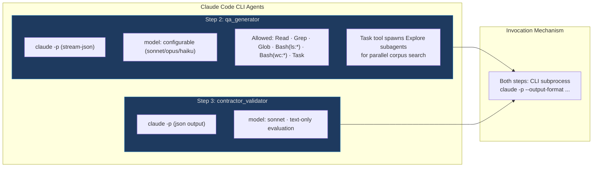
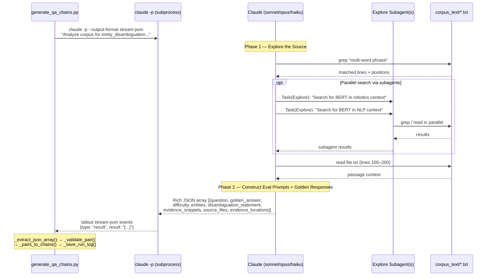
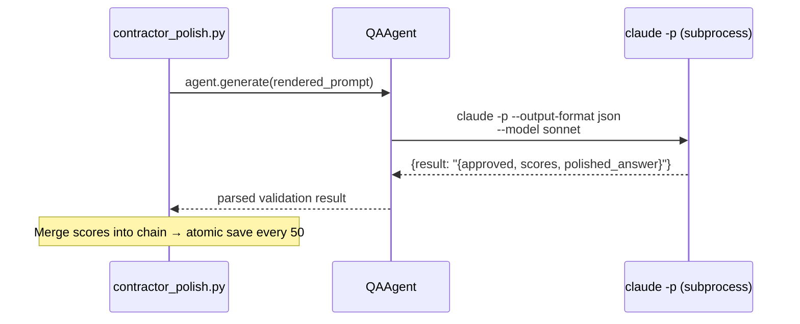
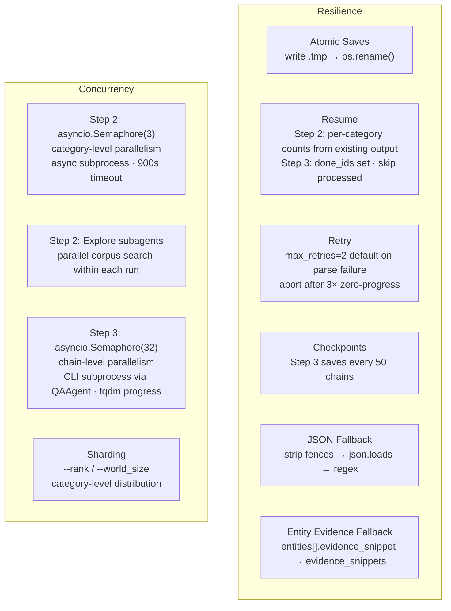
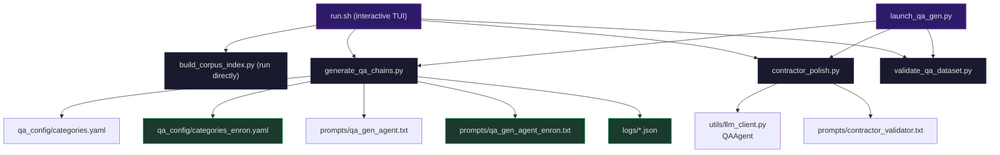
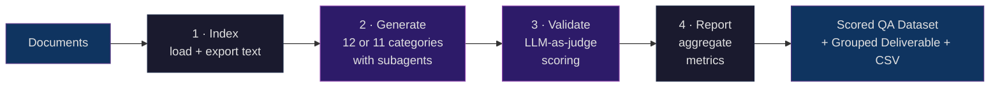

# Long-Context QA Generation Pipeline — Architecture

## End-to-End Pipeline

```mermaid
flowchart TB
    subgraph INPUT["Document Corpus"]
        PDF[".pdf (PyMuPDF)"]
        TXT[".txt / .md"]
    end

    subgraph STEP1["Step 1 — Build Corpus Index"]
        direction TB
        LOAD["Load documents<br/>.txt · .md · .pdf (PyMuPDF)"]
        EXPORT["Export plain-text files<br/>for agent grep / read tools"]

        LOAD --> EXPORT
    end

    subgraph ARTIFACTS1["Index Artifacts"]
        A_TXT["corpus_text/*.txt"]
    end

    subgraph STEP2["Step 2 — Generate Eval Prompts"]
        direction TB

        subgraph CATS["Category Configs"]
            CAT_MAIN["categories.yaml — 12 categories<br/>domain: california_state_case_law<br/>cross_context_synthesis · long_context_citation<br/>hierarchy_comprehension · entity_state_tracking<br/>entity_disambiguation · multi_hop_reasoning<br/>semantic_deduplication · temporal_ordering<br/>domain_scoping · source_prioritization<br/>numerical_aggregation · conflicting_information_synthesis"]
            CAT_ENRON["categories_enron.yaml — 11 categories<br/>domain: enron_email_corpus<br/>(same minus cross_context_synthesis)"]
        end

        subgraph SEED_RUNTIME["Runtime Seeding (generate_qa_chains.py)"]
            S_CTX["Pick random passage from corpus_text/*.txt<br/>for SEED_CONTEXT"]
            S_ENT["SEED_ENTITY set to empty string"]
        end

        RENDER["Prompt Renderer<br/>qa_gen_agent.txt (or qa_gen_agent_enron.txt)<br/>injects: FILE_LIST · CATEGORY_NAME<br/>CATEGORY_DESCRIPTION · N_PAIRS<br/>SEED_CONTEXT · SEED_ENTITY"]

        subgraph HARNESS["Claude Code CLI Subprocess"]
            OC_CMD["claude -p --output-format stream-json<br/>--dir corpus_text/"]

            subgraph AGENT_GEN["Claude Agent"]
                direction LR
                A_MODEL["sonnet/opus/haiku · configurable"]
                A_TOOLS["Grep · Read · Glob · Bash(ls:*) · Bash(wc:*)"]
                A_TASK["Task (spawn Explore subagents<br/>for parallel corpus search)"]
                A_OUT["Rich JSON: question · golden_answer<br/>difficulty · entities · disambiguation"]
            end
        end

        subgraph POSTPROC["Post-Processing"]
            EXTRACT["JSON Extractor<br/>strip fences → json.loads → regex fallback"]
            VALIDATE["Pair Validator<br/>question ends ? · answer ≥20ch<br/>evidence ≥20ch · hop count in range<br/>entity evidence fallback"]
            CONVERT["Chain Converter<br/>UUID chain_id · hop_path construction<br/>preserves difficulty · entities · disambiguation"]
        end

        CATS --> SEED_RUNTIME
        SEED_RUNTIME --> RENDER
        RENDER --> HARNESS
        HARNESS --> EXTRACT
        EXTRACT --> VALIDATE --> CONVERT
    end

    subgraph LOGGING["Structured Run Logs"]
        LOGS["logs/*.json<br/>reasoning · tool_calls · subagent_calls<br/>provenance · cost · duration"]
    end

    subgraph STEP3["Step 3 — Contractor Polish"]
        direction TB
        FMT["Format hop path<br/>human-readable text block"]
        RENDER3["Prompt Renderer<br/>contractor_validator.txt<br/>injects: CHAIN_ID · CATEGORY · CATEGORY_DESCRIPTION<br/>HOP_COUNT · TERMINATION_REASON · QUESTION · HOP_PATH_TEXT"]

        subgraph SESSION["Claude Code CLI Subprocess"]
            S_CMD["claude -p --output-format json"]

            subgraph AGENT_VAL["contractor_validator Agent"]
                direction LR
                V_MODEL["sonnet · text-only evaluation"]
                V_SCORE["Score: category_suitability 0.0–1.0<br/>Score: answer_completeness 0.0–1.0"]
                V_APPROVE["Prompt instructs: approve if both ≥ 0.7<br/>script trusts returned approved flag"]
            end

            S_CMD --> AGENT_VAL
        end

        PARSE3["Parse validation JSON<br/>fallback: approved=false · scores=0.0"]
        FMT --> RENDER3 --> SESSION --> PARSE3
    end

    subgraph STEP4["Step 4 — Validation Report"]
        direction LR
        AGG["Per-category breakdown<br/>approval rate · mean scores<br/>hop distribution · termination reasons"]
        TARGETS["Target assessment<br/>≥80% approval · ≥80% suitability<br/>≥80% completeness · ≥80% pass rate"]
        AGG --> TARGETS
    end

    subgraph OUTPUTS["Pipeline Outputs"]
        O_RAW["qa_chains_raw.json"]
        O_DEL["qa_deliverable_grouped.json<br/>(grouped by category, N samples each)"]
        O_CSV["qa_deliverable.csv<br/>(flat CSV export)"]
        O_VAL["qa_chains_validated.json"]
        O_RPT["validation_report.json"]
    end

    INPUT --> STEP1
    STEP1 --> ARTIFACTS1
    ARTIFACTS1 --> STEP2
    STEP2 --> O_RAW
    STEP2 --> O_DEL
    STEP2 --> O_CSV
    STEP2 --> LOGGING
    O_RAW --> STEP3
    STEP3 --> O_VAL
    O_VAL --> STEP4
    STEP4 --> O_RPT

    style STEP1 fill:#1a1a2e,stroke:#16213e,color:#e0e0e0
    style STEP2 fill:#1a1a2e,stroke:#16213e,color:#e0e0e0
    style STEP3 fill:#1a1a2e,stroke:#16213e,color:#e0e0e0
    style STEP4 fill:#1a1a2e,stroke:#16213e,color:#e0e0e0
    style LOGGING fill:#1a3a2e,stroke:#27ae60,color:#e0e0e0
    style HARNESS fill:#2d1b69,stroke:#8e44ad,color:#e0e0e0
    style SESSION fill:#2d1b69,stroke:#8e44ad,color:#e0e0e0
    style AGENT_GEN fill:#0f3460,stroke:#533483,color:#e0e0e0
    style AGENT_VAL fill:#0f3460,stroke:#533483,color:#e0e0e0
```

## Agent Configuration & Tool Permissions

## Step 2 Detail — Agentic Search with Subagents

## Step 3 Detail — Contractor Validation

## Data Schema — Chain Record Lifecycle

```mermaid
flowchart LR
    subgraph S2["Step 2 produces"]
        direction TB
        F1["chain_id: UUID"]
        F2["category: str (12 or 11 categories)"]
        F3["question: str"]
        F4["final_answer: str"]
        F5["hop_count: int"]
        F6["hop_path: &#91;{hop_index, chunk_id,<br/>chunk_text, partial_answer,<br/>retrieval_score}&#93;"]
        F7["source_file · prompt_seed_file<br/>termination_reason · generated_at"]
        F8["difficulty: easy|medium|hard"]
        F9["entities: &#91;{label, description,<br/>evidence_snippet, evidence_location}&#93;"]
        F10["disambiguation_statement: str"]
        F11["evidence_locations: &#91;{file, start_line, end_line}&#93;"]
        F12["single_answer_heuristic: bool<br/>context_span_lines: int<br/>provenance_report: {unique_files,<br/>grep_queries, total_content_read_chars}"]
    end

    subgraph DEL["Deliverable Export (grouped)"]
        direction TB
        D1["generated_at · domain_scope"]
        D2["categories: &#91;{category_id, category_display_name,<br/>samples: &#91;{relevant_context,<br/>context_location_in_file,<br/>suggested_prompt, golden_response}&#93;}&#93;"]
    end

    subgraph S3["Step 3 enriches with"]
        direction TB
        V1["approved: bool"]
        V2["category_suitability_score: 0.0–1.0"]
        V3["answer_completeness_score: 0.0–1.0"]
        V4["polished_answer: str"]
        V5["rejection_reason: str | null"]
        V6["validated_at: ISO-8601"]
    end

    subgraph S4["Step 4 aggregates"]
        direction TB
        R1["total_chains / total_approved"]
        R2["per_category: count · rate · mean scores"]
        R3["hop_distribution histogram"]
        R4["target assessment (≥80% thresholds)"]
    end

    S2 -->|"export"| DEL
    S2 -->|"+ validation"| S3
    S3 -->|"aggregate"| S4
```

## Structured Run Logs

Each `claude -p` invocation produces a JSON log file in `logs/`:

```mermaid
flowchart TB
    subgraph LOG["logs/{category}_{run_id}.json"]
        direction TB
        L1["run_id · category · timestamp"]
        L2["model · cost_usd · duration_ms"]
        L3["prompt_seed_file"]
        L4["reasoning: &#91;agent text blocks&#93;"]
        L5["tool_calls: &#91;{tool, input,<br/>result_preview, result_length}&#93;"]
        L6["subagent_calls: &#91;{subagent_type,<br/>description, result_preview}&#93;"]
        L7["provenance_summary: {unique_files,<br/>grep_queries, total_content_read_chars}"]
        L8["pairs_generated · pairs_valid · errors"]
    end

    style LOG fill:#1a3a2e,stroke:#27ae60,color:#e0e0e0
```

## Resilience & Concurrency Patterns

## Module Dependency Graph

## TL;DR — High-Level Flow

