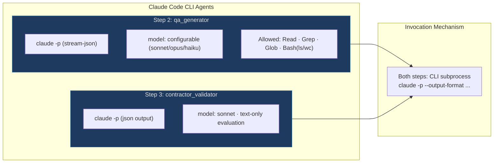
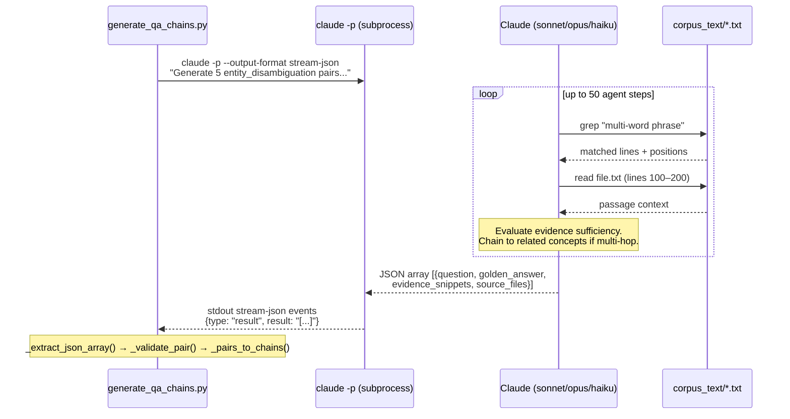
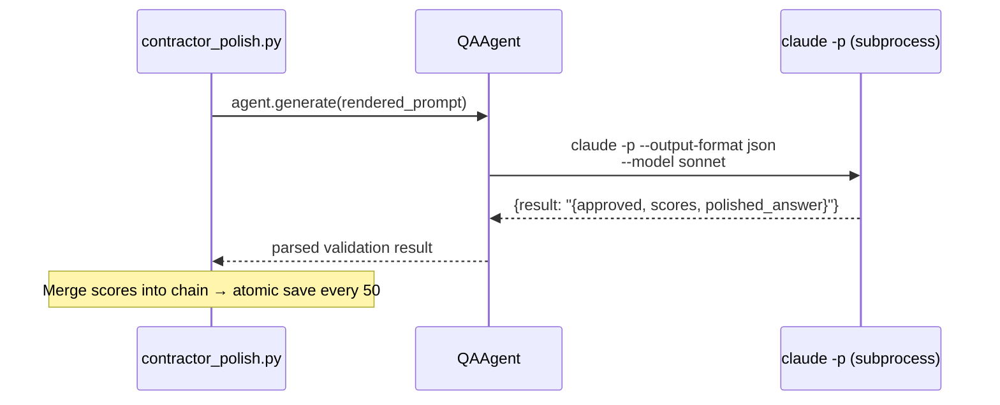
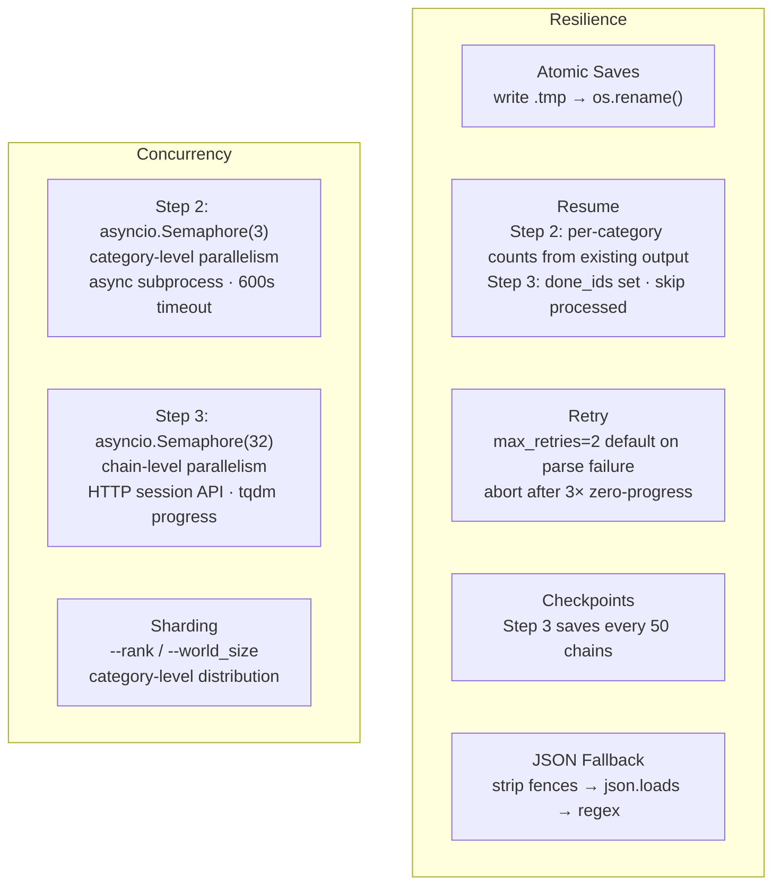
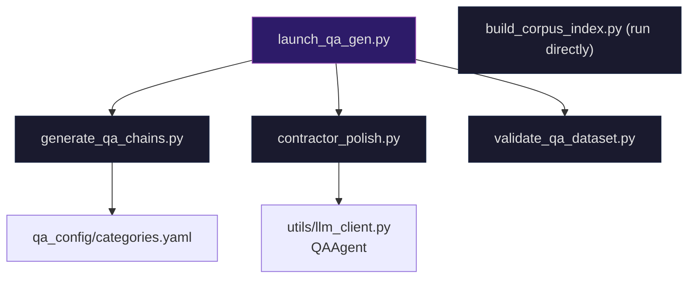

# Long-Context QA Generation Pipeline — Architecture

## End-to-End Pipeline

```mermaid
flowchart TB
    subgraph INPUT["Document Corpus"]
        PDF[".pdf (PyMuPDF)"]
        TXT[".txt / .md"]
    end

    subgraph STEP1["Step 1 — Build Corpus Index"]
        direction TB
        LOAD["Load documents<br/>.txt · .md · .pdf (PyMuPDF)"]
        EXPORT["Export plain-text files<br/>for agent grep / read tools"]

        LOAD --> EXPORT
    end

    subgraph ARTIFACTS1["Index Artifacts"]
        A_TXT["corpus_text/*.txt"]
    end

    subgraph STEP2["Step 2 — Generate Q&A Chains"]
        direction TB

        subgraph CATS["Category Config (categories.yaml)"]
            CAT_ED["entity_disambiguation<br/>hops 1–3"]
            CAT_MH["multi_hop_reasoning<br/>hops 2–4"]
            CAT_SC["single_chunk_factoid<br/>hops 1"]
        end

        subgraph SEED_RUNTIME["Current Runtime Seeding (generate_qa_chains.py)"]
            S_CTX["Pick random passage from corpus_text/*.txt<br/>for SEED_CONTEXT"]
            S_ENT["SEED_ENTITY set to empty string"]
        end

        RENDER["Prompt Renderer<br/>qa_gen_agent.txt<br/>injects: FILE_LIST · CATEGORY_NAME · CATEGORY_DESCRIPTION · N_PAIRS · SEED_CONTEXT · SEED_ENTITY"]

        subgraph HARNESS["Claude Code CLI Subprocess"]
            OC_CMD["claude -p --output-format stream-json<br/>--dir corpus_text/"]

            subgraph AGENT_GEN["Claude Agent"]
                direction LR
                A_MODEL["sonnet/opus/haiku · configurable"]
                A_GREP["Grep (multi-word phrases)"]
                A_READ["Read (±50 lines context)"]
                A_OUT["JSON array of Q&A pairs"]
            end
        end

        subgraph POSTPROC["Post-Processing"]
            EXTRACT["JSON Extractor<br/>strip fences → json.loads → regex fallback"]
            VALIDATE["Pair Validator<br/>question ends ? · answer ≥20ch<br/>evidence ≥20ch · hop count in range"]
            CONVERT["Chain Converter<br/>UUID chain_id · hop_path construction<br/>chunk_id resolution via ChunkStore"]
        end

        CATS --> SEED_RUNTIME
        SEED_RUNTIME --> RENDER
        RENDER --> HARNESS
        HARNESS --> EXTRACT
        EXTRACT --> VALIDATE --> CONVERT
    end

    subgraph STEP3["Step 3 — Contractor Polish"]
        direction TB
        FMT["Format hop path<br/>human-readable text block"]
        RENDER3["Prompt Renderer<br/>contractor_validator.txt<br/>injects: CHAIN_ID · CATEGORY · HOP_PATH_TEXT · QUESTION"]

        subgraph SESSION["Claude Code CLI Subprocess"]
            S_CMD["claude -p --output-format json"]

            subgraph AGENT_VAL["contractor_validator Agent"]
                direction LR
                V_MODEL["sonnet · text-only evaluation"]
                V_SCORE["Score: category_suitability 0.0–1.0<br/>Score: answer_completeness 0.0–1.0"]
                V_APPROVE["Prompt instructs: approve if both ≥ 0.7<br/>script trusts returned approved flag"]
            end

            S_CMD --> AGENT_VAL
        end

        PARSE3["Parse validation JSON<br/>fallback: approved=false · scores=0.0"]
        FMT --> RENDER3 --> SESSION --> PARSE3
    end

    subgraph STEP4["Step 4 — Validation Report"]
        direction LR
        AGG["Per-category breakdown<br/>approval rate · mean scores<br/>hop distribution · termination reasons"]
        TARGETS["Target assessment<br/>≥80% approval · ≥80% suitability<br/>≥80% completeness · ≥80% pass rate"]
        AGG --> TARGETS
    end

    subgraph OUTPUTS["Pipeline Outputs"]
        O_RAW["qa_chains_raw.json"]
        O_VAL["qa_chains_validated.json"]
        O_RPT["validation_report.json"]
    end

    INPUT --> STEP1
    STEP1 --> ARTIFACTS1
    ARTIFACTS1 --> STEP2
    STEP2 --> O_RAW
    O_RAW --> STEP3
    STEP3 --> O_VAL
    O_VAL --> STEP4
    STEP4 --> O_RPT

    style STEP1 fill:#1a1a2e,stroke:#16213e,color:#e0e0e0
    style STEP2 fill:#1a1a2e,stroke:#16213e,color:#e0e0e0
    style STEP3 fill:#1a1a2e,stroke:#16213e,color:#e0e0e0
    style STEP4 fill:#1a1a2e,stroke:#16213e,color:#e0e0e0
    style HARNESS fill:#2d1b69,stroke:#8e44ad,color:#e0e0e0
    style SESSION fill:#2d1b69,stroke:#8e44ad,color:#e0e0e0
    style AGENT_GEN fill:#0f3460,stroke:#533483,color:#e0e0e0
    style AGENT_VAL fill:#0f3460,stroke:#533483,color:#e0e0e0
```

## Agent Configuration & Tool Permissions

## Step 2 Detail — Agentic grep/read Loop

## Step 3 Detail — Contractor Validation

## Data Schema — Chain Record Lifecycle

```mermaid
flowchart LR
    subgraph S2["Step 2 produces"]
        direction TB
        F1["chain_id: UUID"]
        F2["category: str"]
        F3["question: str"]
        F4["final_answer: str"]
        F5["hop_count: int"]
        F6["hop_path: &#91;{hop_index, chunk_id,<br/>chunk_text, partial_answer,<br/>retrieval_score, provenance}&#93;"]
        F7["source_file · prompt_seed_file · termination_reason<br/>single_answer_heuristic · generated_at"]
    end

    subgraph S3["Step 3 enriches with"]
        direction TB
        V1["approved: bool"]
        V2["category_suitability_score: 0.0–1.0"]
        V3["answer_completeness_score: 0.0–1.0"]
        V4["polished_answer: str"]
        V5["rejection_reason: str | null"]
        V6["validated_at: ISO-8601"]
    end

    subgraph S4["Step 4 aggregates"]
        direction TB
        R1["total_chains / total_approved"]
        R2["per_category: count · rate · mean scores"]
        R3["hop_distribution histogram"]
        R4["target assessment (≥80% thresholds)"]
    end

    S2 -->|"+ validation"| S3
    S3 -->|"aggregate"| S4
```

## Resilience & Concurrency Patterns

## Module Dependency Graph

## TL;DR — High-Level Flow

